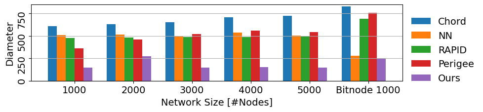

Gossip Protocol Research
===================
# About

- **Swarm Communication**: Agents communicate with peers and resources via a network designed for minimal latency, utilizing overlay topologies.
- **Optimization Strategy**: Starts with a [membership protocol](#References) using Gossip based on multiple Hamilton Cycles.
- **Algorithm Testing**: Employs a greedy algorithm tested against a popular dataset from the bitcoin/blockchain community.
- **Performance Comparison**: Demonstrates that the simple greedy algorithm surpasses other methods like RAPID, CHORD, Nearest Neighbor, and Perigee.
- **Advanced Improvements**: Enhances the greedy algorithm with a Graph Neural Network (GNN)-based Q-learning method for further optimization.



# Installation
Run the following command to set up the codes
```
bash install.sh
```

On Chameleon we need to allow all incoming traffic from the nodes on the subnet. To enable this use the followin command on the nodes.
```
sudo iptables -A INPUT -s 192.168.100.0/24 -j ACCEPT
```

Run the following command to launch 100 RAPID processes locally, at port 1234 to port 1333. The standard output of each process will be directed to test_log/$pid.log, where $pid is the PID of the process.

```
mkdir test_log
./test.sh
```

#### References
[1] Suresh, Lalith, et al. "Stable and consistent membership at scale with rapid." 2018 USENIX Annual Technical Conference (USENIX ATC 18). 2018.
